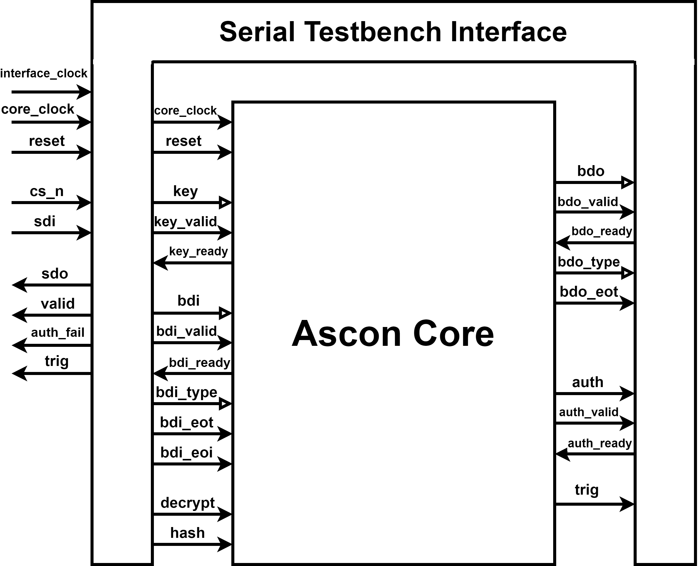

# Open Source Serial Test Ascon ASIC 
Open source IC design of a cryptographic ASIC implementing the NIST's lightweight cryptographic standard selection: Ascon 
Built around the Ascon hardware design by Robert Primas available on [Github](https://github.com/rprimas/ascon-verilog/).

This interface was designed as part of a Major Qualifying Project at Worcester Polytechnic Institue.

## Files

- `chip/*`: Top level chip and pad interconnects. Note: Missing pad lefs and libs
- `constraints/constraints_clk.sdc`: Contains clock definitions and input/output delay options
- `glpower/*`: Directory for gate level power analysis.
- `glsim/*`: Directory for gate level simulation.
- `glsta/*`: Directory for gate level static timing analysis.
- `ivsim/interface_test.sv`: Iverilog compatible testbench for interface simulation.
- `ivsim/config.gtkw`: Saved GTKWave state.
- `ivsim/Makefile`: Iverilog simulation makefile with GTKWave waveform visualization.
- `layout/*`: Directory for layout synthesis.
- `report.pdf`: MQP Report detailing the design and functionality of the device.
- `rtl/ascon_spi.sv`: Verilog serial interface design.
- `sim/interface_test.sv`: Xcelium/Vivado compatible testbench for interface simulation. Note: makefile not included.
- `sim/sipo.sv`: SIPO module used in interface_test.sv.
- `sta/*`: Directory for netlist level static timing analysis.
- `syn/*`: Directory for RTL synthesis.
- `tv/set*/tv.txt`: Test vector files for the verilog test bench.
- From Robert Primas with small modifications:
	- `rtl/ascon_core.sv`: Verilog implementation of the Ascon core.
	- `rtl/asconp.sv`: Verilog implementation of the Ascon permutation.
	- `rtl/config_core.sv`: Configuration file for the Ascon core and test bench.
	- `rtl/tb.sv`: Verilog test bench for the Ascon core.
	

## Interface

The structure of the interface and the Ascon core is shown here:

The following table contains a description of the interface signals:

| **Name**      | **Description**                                                              |
| ------------- | ---------------------------------------------------------------------------- |
| interface_clk | Serial interface clock signal.                                               |
| clock_clk     | Core speed clock signal.                                                     |
| rst           | Reset signal. Note: Synchronous active high.                                 |
| sdi           | Serial data input.                                                           |
| cs_n		| Chip select signal. Note: Active low.                                        |
| sdo           | Serial data output.                                                          |
| valid         | Serial output valid Signal.                                                  |
| auth_fail     | Internal authentication fail flag.                                           |
| trig          | Trigger pin that indicates the beginning of a round of permutations.         |

Look at `ivsim/interface_test.sv` for an example of how the interface can be used.

## Quick Start

- Install the Icarus Verilog (iverilog) open-source verilog simulator:
  - See `https://steveicarus.github.io/iverilog/usage/installation.html`.
  - Current testbench is NOT functional in iverilog
- Execute verilog test bench:
  - `make`
  - Runs `ivsim/interface_test.sv` using the interface design and test vector set 1 as input.
- Execute verilog test bench and show resulting wave forms:
  - `make wave`
  - Same as `make` but also opens the resulting `tb.vcd` in GTKWave.

## Contact

- Trevor Drane (twdrane 'at' wpi.edu)

## Acknowledgements

- Thank you to Professor Patrick Scaumont for all of his input and advice
